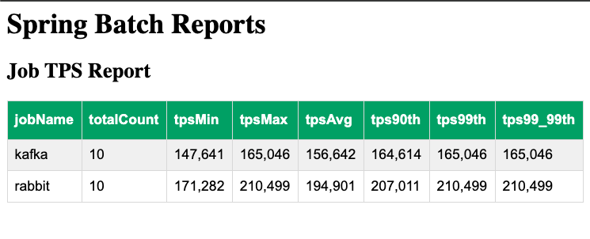

# Overview

This project provides a simplified way to evaluate 
performance differences between [Apache Kafka](https://kafka.apache.org/) and [RabbitMQ streams](https://www.rabbitmq.com/streams.html).
The current version only compares the publishing throughput of 
[RabbitMQ](https://www.rabbitmq.com) and Kafka using [Spring Batch](https://spring.io/projects/spring-batch).


For years, RabbitMQ was not considered for very high throughput requirements. [RabbitMQ stream (introduced in RabbitMQ version 3.9)](https://blog.rabbitmq.com/posts/2021/07/rabbitmq-streams-overview/) now allows RabbitMQ to compete for high throughput use cases. 
The goal of this project is for developers and architectures to explore if RabbitMQ streams has a comparable performance throughput to Apache Kafka. Also see [RabbitMQ vs Kafka: How to Choose an Event-Streaming Broker](https://tanzu.vmware.com/content/blog/rabbitmq-event-streaming-broker).

The following is an example report of the Transactions Per Second (TPS) using the example Spring Batch application to publish 2 millions records. 
The experiments were executed on a Mac OS laptop,  with 32 GB memory, SSD drive, and 10 CPU cores  (Apple M1 Max). 
It uses RabbitMQ version 12.2 and Kafka version 2.13-3.5.1


Note: *totalCount* is the total number of Spring Batch job executions.




### Prerequisite

- [Java Version 17](https://jdk.java.net/17/)
- RabbitMQ Version 3.11 and highers
- [Apache Kafka](https://kafka.apache.org) version 3.5 and higher
- Postgres version 14 and higher (used for the [Spring Batch job repository](https://docs.spring.io/spring-batch/docs/current/reference/html/job.html#configuringJobRepository).)

## Building 

Use the maven ./mvnw script to build the solution

```shell
./mvnw package
```

## Setup

Example Kafka Home directory

```shell
export KAFKA_HOME=/Users/devtools/integration/messaging/apacheKafka/kafka_2.13-4.1.1
```

| Step | Activity                                                                           | Examples/Script                                                                                                   |
|------|------------------------------------------------------------------------------------|-------------------------------------------------------------------------------------------------------------------|
| 1    | RabbitMQ - Setup [Download/Install](https://rabbitmq.com/download.html)            | ```brew install rabbitmq```                                                                                       |
| 2    | RabbitMQ -[Enable Stream Plugin](https://rabbitmq.com/stream.html#enabling-plugin) | ```rabbitmq-plugins enable rabbitmq_stream```                                                                     |
| 3    | Kafka -[Download Apache Kafka](https://kafka.apache.org/downloads)                 | See https://kafka.apache.org/quickstart                                                                           | 
| 4    | Kafka - Generate a Cluster UUID                                                    | ```cd $KAFKA_HOME && KAFKA_CLUSTER_ID="$(bin/kafka-storage.sh random-uuid)"```                                    |
| 5    | Kafka - Format Log Directories                                                     | ```cd $KAFKA_HOME && bin/kafka-storage.sh format --standalone -t $KAFKA_CLUSTER_ID -c config/server.properties``` |
 | 6    | Kafka -  Start the Kafka Server                                                    | ```cd $KAFKA_HOME && bin/kafka-server-start.sh config/server.properties``` |
| 7    | Postgres - [Download/Install Postgres](https://www.postgresql.org/download/)       | ```brew install postgresql@14```                                                                                  |


## Generate Input File
Generate Input file with 2 Million Records

```shell
cd scripts/generate_batch_file
python generate_transaction_file.py
```

# Spring Batch Application 

Publish 2 million records


## RabbitMQ streams

Example

```shell
java -Xms1g -Xmx1g -jar applications/rabbit-vs-kafka-batch/target/rabbit-vs-kafka-batch-1.0.0.jar  --spring.profiles.active=rabbit --spring.rabbitmq.stream.uri=rabbitmq-stream://localhost:5552 --spring.rabbitmq.stream.name=transactions --spring.rabbitmq.stream.username=guest --spring.rabbitmq.stream.password=guest --spring.datasource.url=jdbc:postgresql://localhost:5432/postgres --spring.datasource.username=postgres --spring.datasource.password=
```

See [RabbitMQStreamWriter.java](components/rabbit-stream-batch/src/main/java/experiments/streaming/batch/rabbit/writer/RabbitMQStreamWriter.java)

```java
public class RabbitMQStreamWriter implements ItemWriter<Transaction> {
    //...
    @Override
    public void write(Chunk<? extends Transaction> items) throws Exception {
        items.forEach(transaction ->
                producer.send(producer.messageBuilder()
                        .addData(serializer.convert(transaction)).build(),handler));
    }
}
```

## Apache Kafka

Example 

```shell
java  -Xms1g -Xmx1g  -jar applications/rabbit-vs-kafka-batch/target/rabbit-vs-kafka-batch-1.0.0.jar  --spring.profiles.active=kafka --bootstrap.servers=localhost:9092 --kafka.producer.topic=transaction --spring.datasource.url=jdbc:postgresql://localhost:5432/postgres --spring.datasource.username=postgres --spring.datasource.password=
```

See [KafkaProducerItemWriter.java](components/kafka-batch/src/main/java/experiments/streaming/batch/kafka/KafkaProducerItemWriter.java) 

```java
public class KafkaProducerItemWriter implements ItemWriter<Transaction> {
    //...
    @Override
    public void write(Chunk<? extends Transaction> items) throws Exception {
            items.forEach(transaction ->
                    producer.send(new ProducerRecord<String,byte[]>(
                            topicName,
                            transaction.id(),
                            serializer.convert(transaction)
                    ), handler));
    }
}

```

# Report App

You can use the [rabbit-vs-kafka-report-app](applications/rabbit-vs-kafka-report-app) to view the results.

## Run Application


Example

```shell
java -jar applications/rabbit-vs-kafka-report-app/target/rabbit-vs-kafka-report-app-1.0.0.jar --spring.datasource.url=jdbc:postgresql://localhost:5432/postgres --spring.datasource.username=postgres --spring.datasource.password=
```


Open Browser

```shell
open http://localhost:8080
```

# Cleanup Data 

### Delete Kafka Topic

```shell
$KAFKA_HOME/bin/kafka-topics.sh --bootstrap-server=localhost:9092  --delete --topic transactions
```
### Delete RabbitMQ Stream

```shell
rabbitmqctl --node rabbit delete_queue transactions
```

### Delete Spring Batch Job Repository

```shell
psql -U postgres -d postgres -c 'DROP SCHEMA evt_stream CASCADE'
```