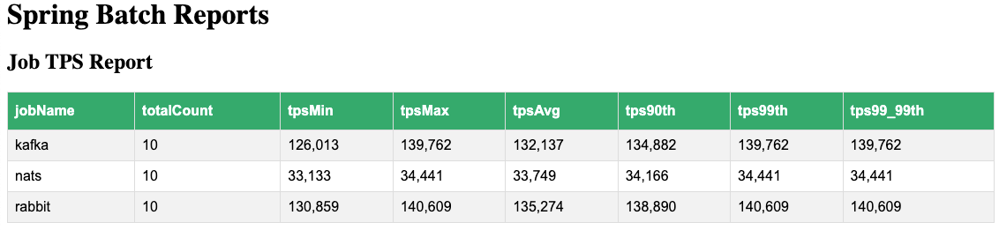

# Running Nats Example


nats

```shell
java  -Xms1g -Xmx1g  -jar applications/rabbit-vs-kafka-batch/target/rabbit-vs-kafka-batch-0.0.1-SNAPSHOT.jar  --spring.profiles.active=nats --nats.server.url="nats://localhost:4222" --nats.subscribe.subject=transaction --spring.datasource.url=jdbc:postgresql://localhost:5432/postgres --spring.datasource.username=postgres --spring.datasource.password= 
```

Local Test Results




# Setup NATs

```shell
brew install nats-server
```
-------------

## Running NATS Servers


See [server flags](https://docs.nats.io/running-a-nats-service/introduction/flags)

best place to store JetStream data would be locally on a fast SSD


```shell
mkdir -p nats
echo "jetstream {  store_dir=nats  }" > js.conf
```

```shell
nats-server -js -c js.conf
```

-------------
# Development Guides

NATS URL

```
nats://server1:port1,nats://server2:port2
```

- When connecting to a cluster it is best to provide the complete set of 'seed' URLs for the cluster.
- These URLs are usually checked in random order as to not have every client connect to the same server.
- highly recommended as a friendly connection name will help in monitoring
- The client and server use a simple PING/PONG protocol to check that either of them are still connected to the other.
- When it knows about other servers, these will be tried next.
- NATS server will treat all messages as opaque byte arrays
- not recommended to use values over 8MB but max_payload can be set up to 64MB (note RabbitMQ max size is 512 MB)
-The Core NATS client libraries try as much as possible to be fire and forget, and you should use JetStream functionalities to get higher qualities of service that can deal with Core NATS messages being dropped due to the server connection being interrupted
- Your applications should use patterns like acknowledgements or use the JetStream publish call to ensure delivery.
- Spring/Spring Cloud Stream support provided by [NATS community](https://github.com/nats-io/spring-nats)
- In general, applications can receive messages asynchronously or synchronously. Receiving messages with NATS can be library dependent.
- There is no special code to subscribe with a wildcard subject. Wildcards are a normal part of the subject name.
- Subscribing to a queue group is only slightly different than subscribing to a subject alone.

**NATS for Persistence**

- As the Key Value Store is built on top of the JetStream persistence layer you obtain a KeyValueManager object from your JetStream context.
- The Object Store allows you to store data of any (i.e. large) size by implementing a chunking mechanism, allowing you to for example store and retrieve files (i.e. the object) of any size by associating them with a path and a file name (i.e. the key).

**NAT Performance**

Asynchronous Subscriptions

- For a given subscription, messages are dispatched serially, one message at a time. If your application does not care about processing ordering and would prefer the messages to be dispatched concurrently, it is the application's responsibility to move them to some internal queue to be picked up by threads/go routines.
- If you have a cluster with 3 seed nodes you often get more network throughput than going through a load balancer

**NATS Reliable Delivery**

Receiving and dropping messages from the server keeps the connection to the server healthy, but creates an application requirement. There are several common patterns:

- Using core NATS is ideal for the fast request path for scalable services where there is tolerance for message loss or when applications themselves handle message delivery guarantees.
-  it is better for applications to use the JetStream Publish calls (which Core NATS subscribers not using Streams will still receive like any other publication) when publishing to a stream as:
- Some libraries, like Java, will not send this notification on every dropped message because that could be noisy. Rather the notification may be sent once per time the subscriber gets behind. Libraries may also provide a way to get a count of dropped messages so that applications can at least detect a problem is occurring.
- Use request-reply to throttle the sender and prevent overloading the subscriber
- Use a queue with multiple subscribers splitting the work
- Persist messages with something like NATS streaming
- applications can use a flush call to tell the library to move data through the system.
- Drain provides clients that use queue subscriptions with a way to bring down applications without losing any messages. A client can bring up a new queue member, drain and shut down the old queue member, all without losing messages sent to the old client. Without drain, there is the possibility of lost messages due to delivery timing. For a connection the process is essentially:
  - Drain all subscriptions 
  - Stop new messages from being published 
  - Flush any remaining published messages 
  - Close
  
Limiting Incoming/Pending Messages by Count and Bytes
- The first way that the incoming queue can be limited is by message count. 
- The second way to limit the incoming queue is by total size. 

For example, to limit the incoming cache to 1,000 messages or 5mb whichever comes first:


## Connecting

```java
Options options = new Options.Builder().
        server("nats://demo.nats.io:4222").
        connectionName("API Name Option Example"). // Set Name
        reconnectWait(Duration.ofSeconds(10)).
        reconnectBufferSize(5 * 1024 * 1024).  // Set buffer in bytes
        build();
        Connection nc = Nats.connect(options);

// Do something with the connection

        nc.close();

// Do something with the connection

nc.close();
```

## Pub JetStreams

```java
package io.nats.examples.jetstream;

import io.nats.client.Connection;
import io.nats.client.JetStream;
import io.nats.client.Message;
import io.nats.client.Nats;
import io.nats.client.api.PublishAck;
import io.nats.client.impl.NatsMessage;
import io.nats.examples.ExampleArgs;
import io.nats.examples.ExampleUtils;

import java.nio.charset.StandardCharsets;

/**
 * This example will demonstrate JetStream publishing.
 */
public class NatsJsPub {
  static final String usageString =
          "\nUsage: java -cp <classpath> NatsJsPub [-s server] [-strm stream] [-sub subject] [-mcnt msgCount] [-m messageWords+] [-r headerKey:headerValue]*"
                  + "\n\nDefault Values:"
                  + "\n   [-strm] example-stream"
                  + "\n   [-sub]  example-subject"
                  + "\n   [-mcnt] 10"
                  + "\n   [-m]    hello"
                  + "\n\nRun Notes:"
                  + "\n   - msg_count < 1 is the same as 1"
                  + "\n   - headers are optional"
                  + "\n\nUse tls:// or opentls:// to require tls, via the Default SSLContext\n"
                  + "\nSet the environment variable NATS_NKEY to use challenge response authentication by setting a file containing your private key.\n"
                  + "\nSet the environment variable NATS_CREDS to use JWT/NKey authentication by setting a file containing your user creds.\n"
                  + "\nUse the URL in the -s server parameter for user/pass/token authentication.\n";

  public static void main(String[] args) {
    ExampleArgs exArgs = ExampleArgs.builder("Publish", args, usageString)
            .defaultStream("example-stream")
            .defaultSubject("example-subject")
            .defaultMessage("hello")
            .defaultMsgCount(10)
            .build();

    String hdrNote = exArgs.hasHeaders() ? ", with " + exArgs.headers.size() + " header(s)" : "";
    System.out.printf("\nPublishing to %s%s. Server is %s\n\n", exArgs.subject, hdrNote, exArgs.server);

    try (Connection nc = Nats.connect(ExampleUtils.createExampleOptions(exArgs.server))) {

      // Create a JetStream context.  This hangs off the original connection
      // allowing us to produce data to streams and consume data from
      // JetStream consumers.
      JetStream js = nc.jetStream();

      // Create the stream
      NatsJsUtils.createStreamOrUpdateSubjects(nc, exArgs.stream, exArgs.subject);

      int stop = exArgs.msgCount < 2 ? 2 : exArgs.msgCount + 1;
      for (int x = 1; x < stop; x++) {
        // make unique message data if you want more than 1 message
        String data = exArgs.msgCount < 2 ? exArgs.message : exArgs.message + "-" + x;

        // create a typical NATS message
        Message msg = NatsMessage.builder()
                .subject(exArgs.subject)
                .headers(exArgs.headers)
                .data(data, StandardCharsets.UTF_8)
                .build();

        // Publish a message and print the results of the publish acknowledgement.
        // We'll use the defaults for this simple example, but there are options
        // to constrain publishing to certain streams, expect sequence numbers and
        // more. See the NatsJsPubWithOptionsUseCases.java example for details.
        // An exception will be thrown if there is a failure.
        PublishAck pa = js.publish(msg);
        System.out.printf("Published message %s on subject %s, stream %s, seqno %d.\n",
                data, exArgs.subject, pa.getStream(), pa.getSeqno());
      }
    }
    catch (Exception e) {
      e.printStackTrace();
    }
  }
}
```


# Core NATS


## Subscriptions


```java
Dispatcher d = nc.createDispatcher((msg) -> {
    // do something
});

d.subscribe("updates");

d.setPendingLimits(1_000, 5 * 1024 * 1024); // Set limits on a dispatcher

// Subscribe
Subscription sub = nc.subscribe("updates");

sub.setPendingLimits(1_000, 5 * 1024 * 1024); // Set limits on a subscription

// Do something

// Close the connection
nc.close();
```

## Publishings


```java
nc.publish("updates", "All is Well".getBytes(StandardCharsets.UTF_8));

// Make sure the message goes through before we close
nc.flush(Duration.ZERO);
nc.close();
```